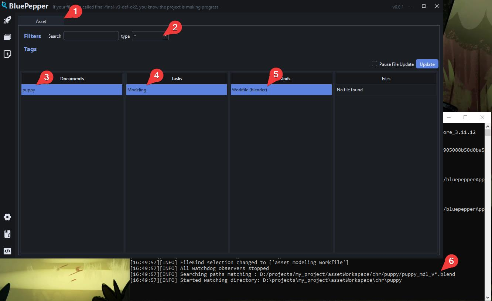
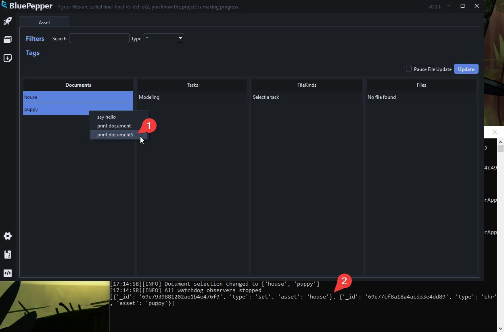
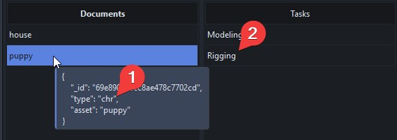
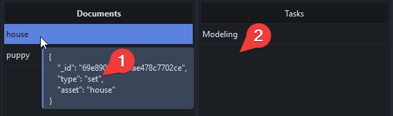
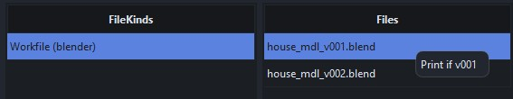
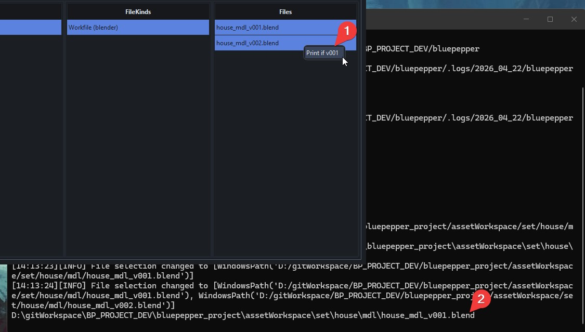
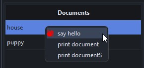

# Configuring the Browser

The Browser is structured as follows:

`Entities` → `Tasks` → `FileKinds` → `Files`

- **Entities** define which database collections the user can browse. The obvious ones are assets and shots, but you may want to create additional entities (episodes, levels, etc.).

- **Tasks** group file kinds together within an entity, think of them as a convenient way to organise files by department.

- **FileKinds** are essentially a Lucent `Convention`, they define which specific files should be surfaced in the Browser.

- **Files** are the result of a file discovery that matches the selected `Documents` against the selected `FileKind`.

The Browser is configured through the file `conf/app_browser.py`:memo:. Similar to the file `conf/naming_conventions.py`:memo:, it will contain a lot of examples for demonstration purposes. In the following sections, we'll see how to create it from scratch.

Clear out the file `conf/app_browser.py`:memo: and create a blank AppConfig inside a function `get_tool_config()`. We will also import everything we need later on.

=== "python"
    ```python
    from pathlib import Path
    from bluepepper.core import codex
    from bluepepper.tools.browser.browser_config import (
        AppConfig,
        Entity,
        FileKind,
        MenuAction,
        Task,
    )


    def get_tool_config() -> AppConfig:
        config = AppConfig("bigBrowserMainApp")
        return config
    ```

## Entities

Declare the entities you want to access (typically assets and shots). Adding an entity automatically adds a tab to the interface:

=== "python"
    ```python
    asset_entity = Entity(name="asset", collection="assets", filters=["type"])
    config.add_entity(asset_entity)
    ```

The `collection` parameter indicates which MongoDB collection the Browser will query for documents. By default, BluePepper uses the `assets` and `shots` collections, but you can create additional entities and corresponding collections as needed.

Note that filters must be consistent with what you have defined in `naming_conventions.py`:memo:. For instance, the Browser will not be able to create an "episode" filter if the "episode" field does not exist in your Codex.

Documents from the specified collection will appear in the first column of the interface, with filtering options available at the top.

## Tasks

You can now create tasks within your entity. Tasks are a way to group file kinds according to your departments' needs:

=== "python"
    ```python
    asset_modeling_task = Task("modeling")
    asset_entity.add_task(asset_modeling_task)
    ```

Tasks appear in the second column of the interface.

## FileKinds

Populate your tasks with file kinds. A `FileKind` provides access to files matching a specific convention from your project's Codex:

=== "python"
    ```python
    kind = FileKind(
        name="asset_modeling_workfile",
        label="Workfile",
        convention=codex.convs.asset_modeling_workfile,
    )
    asset_modeling_task.add_kind(kind)
    ```

FileKinds appear in the third column of the interface. When selecting a `Document` and a `FileFind` the result of a file discovery appears in the fourth column of the interface.

### Result
Before going further, we should take a look at the result. Here is the full code so far:

=== "python"
    ```python
    from bluepepper.core import codex
    from bluepepper.tools.browser.browser_config import (
        AppConfig,
        Entity,
        FileKind,
        Task,
        MenuAction
    )


    def get_tool_config() -> AppConfig:
        config = AppConfig("bigBrowserMainApp")
        asset_entity = Entity(name="asset", collection="assets", filters=["type"])
        config.add_entity(asset_entity)
        asset_modeling_task = Task("modeling")
        asset_entity.add_task(asset_modeling_task)
        kind = FileKind(
            name="asset_modeling_workfile",
            label="Workfile (blender)",
            convention=codex.convs.asset_modeling_workfile,
        )
        asset_modeling_task.add_kind(kind)
        return config
    ```

When opening the Browser, you can see the result:
1. There is a single "Asset" tab
2. Assets can be filtered by type
3. The first column displays the available assets
4. The Modeling task is available
5. And contains a Workfile task
6. While there is still no file on the server right now, the console shows that the Browser is actively looking for files that match the naming convention.


## Actions

Contextual menu actions can be added to documents, kinds, and files, allowing you to define which actions are available when right-clicking on various elements of the interface.

For example:

- Create a new file in `conf/scripts` (for example, `print_stuff.py`)
- Define a function in that file:

=== "python"
    ```python
    def say_hello() -> None:
        print("Hello World")
    ```

- In `conf/app_browser.py`:memo:, add an action that calls this function:

=== "python"
    ```python
    action = MenuAction(
        label="say hello",
        module="conf.scripts.print_stuff",
        callable="say_hello",
    )
    asset_entity.add_document_action(action)
    ```

When you right-click on an asset document, the "say hello" action should appear, and "Hello World" will be printed to the console when you click it.


### Passing Arguments to Actions

Printing "Hello World" is a fine start, but what if you need to pass the selected documents or files as arguments?

As an example, we will add a new function to `print_stuff.py`:memo:

=== "python"
    ```python
    def print_selection(selection):
        print(selection)
    ```

And add these lines to `app_browser.py`:memo:

=== "python"
    ```python
    action = MenuAction(
        label="print document",
        module="conf.scripts.print_stuff",
        callable="print_selection",
        kwargs={"selection": "<document>"}
    )
    asset_entity.add_document_action(action)
    ```

Now, see the result, with two documents selected:


You can use the `kwargs` attribute with all the following special keywords, which are automatically substituted when passed to your functions:

- `<document>`: Each of the selected documents
- `<documents>`: List of all selected documents
- `<document_name>`: Each of the selected documents' names
- `<document_names>`: List of all selected documents' names
- `<document_id>`: Each of the selected documents' MongoDB IDs
- `<document_ids>`: List of all selected documents' MongoDB IDs
- `<path>`: Each selected path
- `<paths>`: List of all selected paths
- `<convention>`: The selected Convention object
- `<browser>`: The BrowserWidget object

### Dealing With Multiple Selection

When triggering an action with multiple documents or paths selected, you may actually want two distinct outcomes:

- Executing the action for each selected item, with each item passed as argument
- Executing the action only once, with a list of items passed as argument

Hopefully, the `mode` argument, can be set to `each` or `all` to cover these two cases.

=== "python"
    ```python
    action = MenuAction(
        label="print documentS",
        module="conf.scripts.print_stuff",
        callable="print_selection",
        kwargs={"selection": "<documents>"},
        mode="all"
    )
    asset_entity.add_document_action(action)
    ```

As explained, the result is now printed as a list, instead of printing the documents one by one.



!!! warning
    The kwargs and the mode must make sense together: passing `<documents>` in `each` mode will indeed not work.

### Filtering Tasks and Actions

What if a task should only appear for a specific type of assets? What if an action should only be available for some specific files? Filters have you covered.

There are two types of filters:

- `doc_filter`: Depends on the document
- `path_filter`: Depends on the path

Create a function that returns `True` if your condition is met, `False` otherwise. Here are some examples:

=== "python"
    ```python
    # Task "Rigging" will only appear if a character asset is selected
    def is_chr(doc: dict) -> bool:
        return doc.get("type") == "chr"

    asset_rigging_task = Task("rigging", doc_filter=is_chr)
    asset_entity.add_task(asset_rigging_task)
    ```

The rigging task should appear for `chr` assets only:




The same logic applies to files.

=== "python"
    ```python
    def is_version_one(path: Path) -> bool:
        return path.stem.endswith("v001")

    action = MenuAction(
        label="Print if v001",
        module="conf.scripts.print_stuff",
        callable="print_selection",
        kwargs={"selection": "<path>"},
        path_filter=is_version_one,
    )
    kind.add_file_action(action)
    ```

In this example, the context menu is only available for v001 files:



What if you have both a v001 and a v002 selected? The Browser handles this gracefully. The menu action will appear, but it will only execute on documents/files that match your filter.



### Adding Icons to Menu Actions

When declaring your `MenuAction`, you can add a custom icon and set a custom colour:

=== "python"
    ```python
    action = MenuAction(
        label="say hello",
        module="conf.scripts.print_stuff",
        callable="say_hello",
        qta_icon="mdi6.hand-wave",
        qta_icon_color="#FF0000"
    )
    ```



!!! tip
    To learn how to get icon codes, see [Tips And Tricks - QtAwesome Icons](./dev_tips_and_tricks/#qtawesome-icons)

### Creating a Batcher Job through a MenuAction

To submit a job to the Batcher, instead of running the action in the main Thread, one can use a `BatcherMenuAction` instead of a regular `MenuAction`.

=== "python"
    ```
    from bluepepper.tools.browser.browser_config import BatcherMenuAction

    action = BatcherMenuAction(
        label="Build Workfile",
        job_name="Build Workfile - <document_name>",
        job_description="Copying empty blender file at the proper location for <document_name>",
        batcher_module="conf.scripts.example_build_modeling_workfile",
        batcher_function="main",
        batcher_kwargs={"document": "<document>"},
        batcher_notification=True,
        batcher_notification_message="<document_name> - New workfile was created",
    )
    modeling_workfile_kind.add_kind_action(action)
    ```

Executing this action will submit jobs to the Batcher.


---

!!! info ""
    <a href="Next Section"> <div style="text-align: right; font-weight: bold"> [Next Section : Embedded FastAPI Server](./dev_fastapi.md) </div>