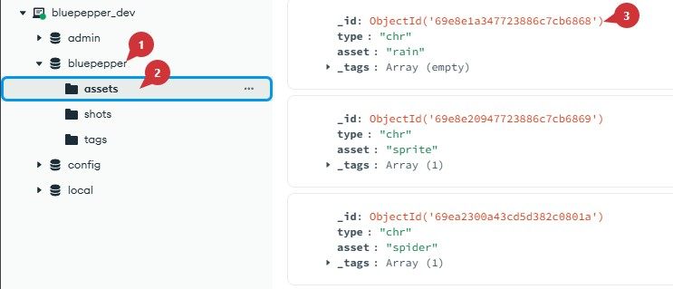
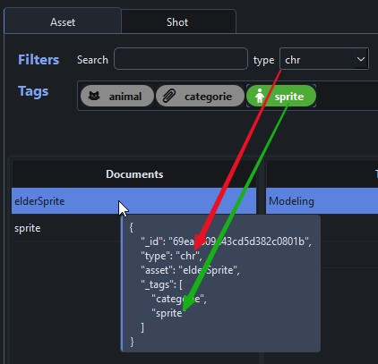
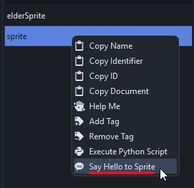

# Core Concepts

BluePepper relies on a few key components that one should learn to unlock the its full potential.

## MongoDB Server

BluePepper needs an underlying database that contains all the `Documents` for your project (primarily assets and shots). A `Document` is essentially the identity card of an asset or shot, think of it as metadata that BluePepper uses across many of its features.

### Structure

Here is the structure of the MongoDB Server:



- :one: The server has a `Database` for each project.

    ??? question "Did you say ''each'' project?"
        A BluePepper installation is designed to handle a single project. However, you may have multiple BluePepper installations that all connect to the same MongoDB server, but that use different project databases.

- :two: The project's database contains a `Collection` for each type of object to store
- :three: Each collection contains all the `Documents` representing assets and shots.

The structure is purposefully simple, in the sense that there is no complex hierarchy between objects, and that document solely consist of dictionaries containing strings. The end goal here is to provide a simple way of querying documents and resolving naming conventions. More on that in the next section.

## Codex

The Python package [Lucent](https://pypi.org/project/lucent-codex/) is used to declare all the naming conventions for your project (i.e., how files should be named, where they should be stored, and which characters are allowed or forbidden).

Lucent holds everything together within a `Codex`, which contains `Conventions` (string templates made up of fields) and `Rules` (that define how fields should behave).

BluePepper makes extensive use of the `Codex` to ensure naming conventions, file discovery, and generating strings/paths. 

??? example "If this is not clear, you can read this example"
    Let's illustrate the use of the Codex with an example that uses a `Convention` and an asset `Document` from the demo project:

    ```
    bluepepper_project/assetWorkspace/{type}/{asset}/mdl/blender/{asset}_mdl_v{version}_{description}.blend
    ```

    As you can see, the Convention needs the fields `type` and `asset` that can be filled by providing the following Document from the Database:

    ```json
    {
        "_id": "69ea2309a43cd5d382c0801b",  # won't be used
        "type": "chr",
        "asset": "elderSprite",
    }
    ```

    Here is the result for now:

    ```
    bluepepper_project/assetWorkspace/chr/elderSprite/mdl/blender/elderSprite_mdl_v{version}_{description}.blend
    ```

    The `version` and `description` fields are still missing. Hopefully, you see where this is going:

    - We can look for files with any `version` and `description` values
    - We can fill in `version` and `description` as extra data to compose a fully-fledged path.


!!! info
    For more information, refer to the [Lucent documentation](https://github.com/tristanlanguebien/lucent)

## Browser

Thanks to the previous sections, you should now guess how BluePepper's Browser operates under the hood : it uses the `Database` in conjonction with the `Codex` to look for documents and files.

- When you select a `Document` and a file type, you are effectively creating a file search that resolves the naming convention using the asset or shot document.
    

- The Documents' attributes are used for filtering.
    

- The filtering extends to the contextual menu that appears when you right click on an element (for instance, trigger a specific action only for assets that have the `sprite` tag)
    

---

!!! info ""
    <a href="Next Section"> <div style="text-align: right; font-weight: bold"> [Next Section : Setting Up a Development Environment](./dev_environment.md) </div>