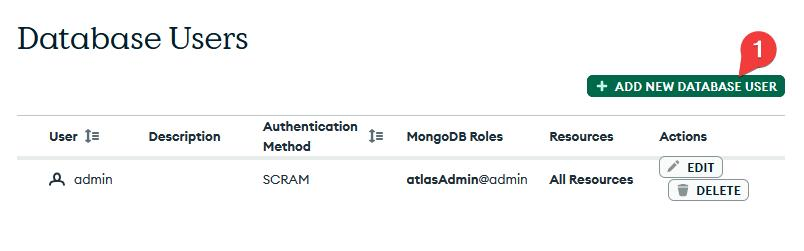
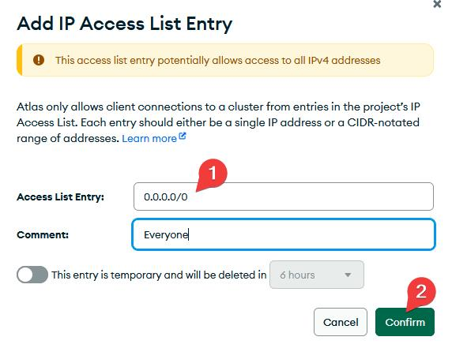
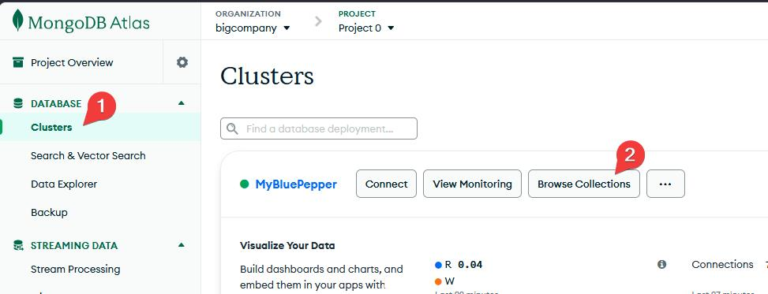
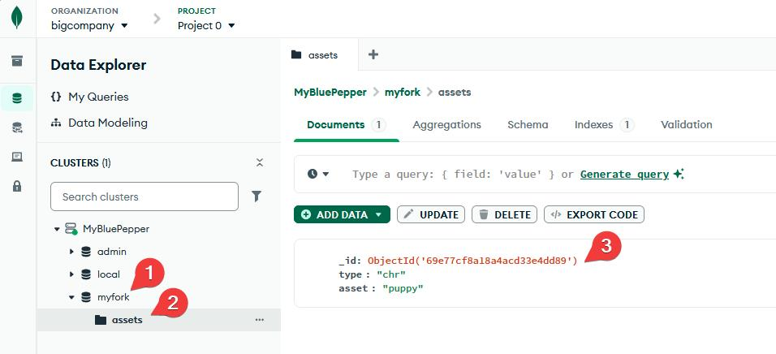

# Setting Up The Database

In the `conf/mongodb.py`:memo: file, several connection modes to a MongoDB database are available:

=== "python"
    ```python
    @dataclass(frozen=True)
    class DatabaseSettings:
        database_name: str = "bluepepper"
        mode: str = "local"  # host-port, uri, or local
        host: str = "127.0.0.1"
        port: int = 27017
        user: str | None = None
        password: str | None = None
        uri: str | None = "mongodb://<db_username>:<db_password>@..."
    ```

- **local**: Probably the best option if you just want to test BluePepper or use it on a personal project.

    !!! warning
        Keep in mind, however, that the server runs locally and only while the application is open. This option is not suitable for collaborative work.

- **host-port**: If you or your IT department can set up a dedicated MongoDB server, this option will likely suit your needs.
- **uri**: If setting up a MongoDB server yourself is not an option, the easiest solution is to use an online hosting service and connect using the URI it provides.

## MongoDB Atlas Setup (Optional)

!!! info
    This section is intended for users who need help setting up a MongoDB server. If this does not apply to you, feel free to skip to the next section.

MongoDB Atlas allows you to host one database for free per account. Since BluePepper does not require a large database, the free tier works perfectly well.

!!! warning
    Keep in mind that the free tier does not include backups.

### Cluster Creation

- Go to https://www.mongodb.com/products/platform/atlas-database and click `Get Started` to create an account.
- Follow the welcome instructions, or navigate to
  **Account → Organizations → {your organization} → All Projects → Project 0 → Project Overview → Create**
- On the next page:
    - Choose the **Free** tier.
    - Give your cluster a name (for example, `bluepepperDB`).
    - Uncheck **"Preload sample dataset"**.
    - Click **"Create Deployment"**.


### Admin User

MongoDB will ask for an admin password. Set it and store it somewhere safe.


### Connection String

Next, MongoDB will ask for a connection method.

- Select **Drivers → Python**
- uncheck **"SRV Connection String"** and **Show Password**
- copy the **Connection String** and keep it somewhere safe.
    !!! failure
        the SRV connection string relies on a DNS server, which may fail on VPN networks.


### Read-Write User

You may create an additional user if you wish to fine-tune permissions. Under the **Security** section, go to **Database & Network Access**, where you can create a new database user and set its privileges to **"Read and write any database"** instead of **"Admin"**.




### Opening To The World

For now the database will only be allowed for your IP address. To allow the database to be accessed from anywhere on the internet:
- In **Database & Network Access**, go to **IP Access List**
- Add the IP address `0.0.0.0/0`



### Back To mongodb.py

Now that your database is now up and running, open `conf/mongodb.py`:memo:.

- Set the mode to `"uri"`.
- Paste the connection string as the value for `"uri"` (don't forget to set the proper username and password).
- Save the file.

=== "python"
    ```python
    @dataclass(frozen=True)
    class DatabaseSettings:
        database_name: str = "myProjectDB"
        mode: str = "uri"
        host: str = "127.0.0.1"  # Won't be used
        port: int = 27017  # Won't be used
        user: str | None = None  # Won't be used
        password: str | None = None  # Won't be used
        uri: str | None = "mongodb://<db_username>:<db_password>@..."
    ```

BluePepper should now be able to connect to your MongoDB Atlas database.

Feel free to create an asset and a shot in BluePepper to see how the database is structured. You can browse your database via **MongoDB Atlas → Clusters → Browse Collections**, or use a dedicated application such as [MongoDB Compass](https://www.mongodb.com/products/tools/compass).



