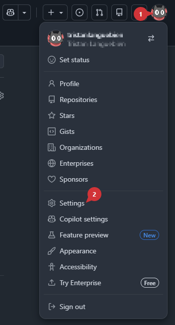
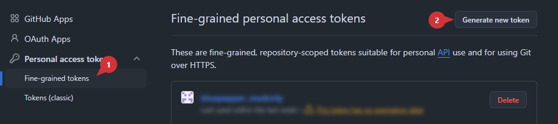
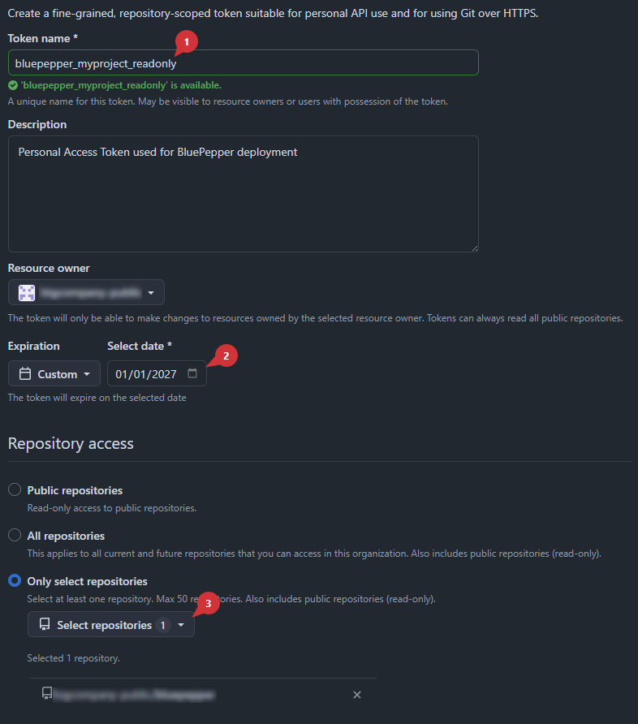
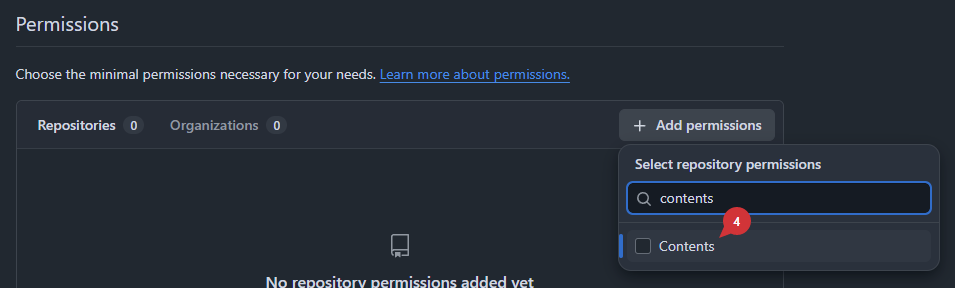
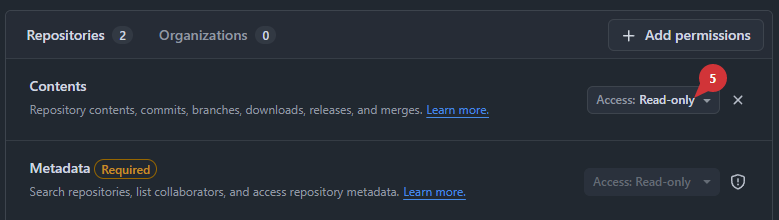
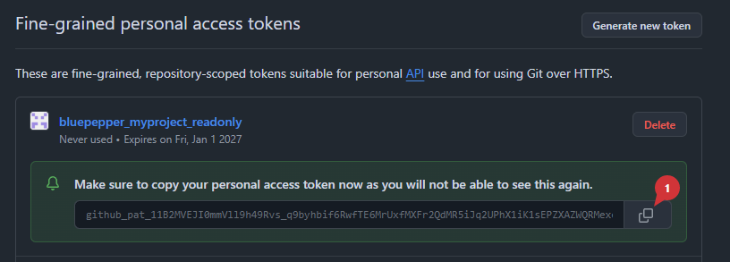

# Deploying BluePepper

BluePepper simply uses git to handle the version of the codebase that gets deployed across your team. As a result, downloading BluePepper is basically a `git clone` command, and updating it is basically a `git fetch / git checkout`.

This section explains how to set up git for this purpose.

## Setting Up A Personal Access Token

To ensure users can clone and update the repository **without** being able to push code and **without** having to create a git account, a Personal Access Token (PAT) has to be created.

- On github, go to your user settings

    

- At the very bottom, go to Developer Settings -> Personal access tokens -> Fine-grained tokens (you may have to verify your request with 2FA)

    

- Setup your token. Most importantly:
    - :one: Set its name
    - :two: Set an expiration date
    - :three: Restrict the scope to a single repository
    - :four: In `Permissions`, add `Contents`
    - :five: Ensure the Content's access is set to `Read-only`
    - Press `Generate token`

    
    
    

!!! warning "Save your token somewhere safe, as you won't be able to access it later"
    
    

## Download and Install Script

The script `conf/deploy_enduser.bat` :memo: is designed to provide a simple and efficient way to deploy BluePepper to your team. One just needs to provide the URL to the git repository and the Personal Access Token. You have two ways of doing that:

- Edit the `conf/deploy_enduser.bat` :memo: to set the environment variables `BLUEPEPPER_GIT_URL` and `BLUEPEPPER_GIT_PAT`

    ```bat
    SET BLUEPEPPER_GIT_URL=https://github.com/your-username/bluepepper_myproject.git
    SET BLUEPEPPER_GIT_PAT=your_readonly_personal_access_token
    ```

- Edit the `conf/deploy_enduser.bat` :memo: and remove the lines `SET BLUEPEPPER_GIT_URL=` and `SET BLUEPEPPER_GIT_PATH=`
    - Since the required values are not written in the file, you will have to set the environment variables yourself on the user's computer
    - As the Personal Access Token only has read-only permissions, this shouldn't be too much of a security issue, but you may prefer this option if confidentiality is important for you.

!!! success "When your script is ready, you can give it to your team and simply double click on it. BluePepper will be downloaded and installed next to the script."


## Updating BluePepper

When BluePepper is launched, the update happens during the splash screen. The update consists of a `git fetch` and `git pull` to get all changes made to the repository, and a `git checkout` to set the repository in a specific state.

By default, the update checks out the `main` branch, but you can specify the branch, the commit, or the tag to check out in the `conf/deployment.json` :memo: file.

=== "main (default)"
    ```json
    {
        "checkout" : "main"
    }
    ```

=== "branch"
    ```json
    {
        "checkout" : "my_feature_branch"
    }
    ```

=== "tag"
    ```json
    {
        "checkout" : "tags/v0.0.5"
    }
    ```

=== "commit hash"
    ```json
    {
        "checkout" : "3df878d3619d8aaf836c0b77e1c3a7b3ee124519"
    }
    ```


??? tip "About Dev Mode"
    If BluePepper was installed using the `install_dev.bat` script, the callback that updates the code and the packages will not be triggered.

---

!!! info ""
    <a href="Next Section"> <div style="text-align: right; font-weight: bold"> [Next Section : Embedded FastAPI Server](./dev_fastapi.md) </div>