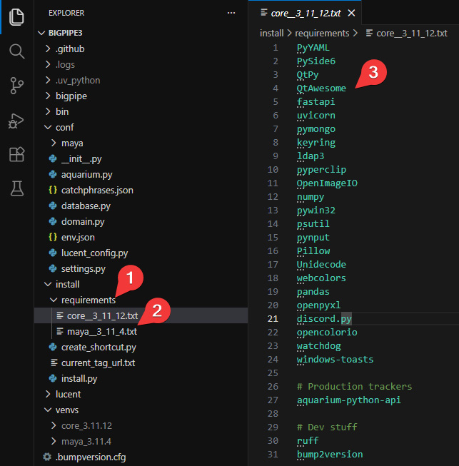
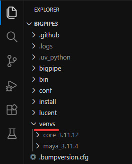
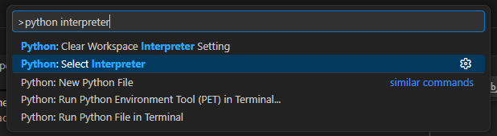
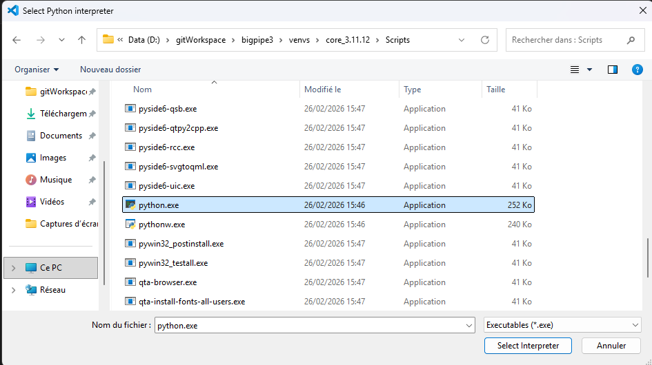
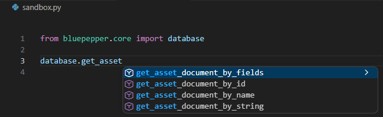

# Setting Up a Development Environment

## Forking and Cloning

- Fork [the repository](https://github.com/bigcompany-public/bluepepper) to your personal GitHub page (for example, `bluepepper_myProject`). This will make it easier to edit the configuration and deploy it to your team later.
    

- Clone the repository.

    ```
    git clone https://github.com/my-account/bluepepper_myproject.git
    ```

## Installation

- Run `install_dev.bat`.
- You can now open the app using the newly created BluePepper shortcut.

??? question "Why are there two installation scripts?"
    You may have noticed bluepepper's directory contains an `install_dev.bat` file and an `install_enduser.bat`.
    
    The first initializes the repository in a way that prevents the update callback from triggering. This way, you can do your own thing without BluePepper scraping all your changes at launch.

??? question "How does the installation actually work?"
    The installation uses UV to install the Python virtual environments and the Python packages needed by BluePepper.

    The configuration files that drive the installation are located in `conf/requirements` :open_file_folder:, with each file representing a separate virtual environment and containing the list of Python packages to install.

    

    For each file, a new virtual environment is created in the folder `venvs` :open_file_folder:.

    

    ??? question "Why multiple virtual environments?"
        All the software used on your project won't use the same version of Python, which can cause compatibility issues. Since all software will at the very least need access to the Database and the Codex, each environment needs a dedicated Python environment where `pymongo` and `lucent` are installed.

## Running BluePepper Like a Dev

### Opening BluePepper GUI

Once the python interpreter is configured, you can run BluePepper from your terminal by executing `main.py` :memo:.

=== "powershell"
    ```powershell
    & ./venvs/core_3.11.12/Scripts/python.exe ./main.py
    ```

### Running a Script

!!! tip
    Git is configured to ignore all files named `sandbox.py` :memo:. If you need to test some code, just create a `sandbox.py` file and run it.

- Let's try to execute this piece of code: 

    === "python"
        ```python
        from bluepepper.core import codex

        print(codex.human_readable)
        ```

    !!! bug
        This will not work because BluePepper needs to setup a few environment variables first.

        === "python"
        ```python
        Traceback (most recent call last):
        File "d:\gitWorkspace\BP_PROJECT_DEV\bluepepper\sandbox.py", line 1, in <module>
            from bluepepper.core import codex
        File "d:\gitWorkspace\BP_PROJECT_DEV\bluepepper\bluepepper\core.py", line 5, in <module>
            from bluepepper.database import database
        File "d:\gitWorkspace\BP_PROJECT_DEV\bluepepper\bluepepper\database.py", line 18, in <module>
            from conf.naming_conventions import codex
        File "d:\gitWorkspace\BP_PROJECT_DEV\bluepepper\conf\naming_conventions.py", line 10, in <module>
            root_dir = Path(os.environ["BLUEPEPPER_ROOT"])
                            ~~~~~~~~~~^^^^^^^^^^^^^^^^^^^
        File "<frozen os>", line 679, in __getitem__
        KeyError: 'BLUEPEPPER_ROOT'
        ```

- To open a new terminal with the proper environment variables, run the following command:

    === "powershell"
        ```powershell
        & ./venvs/core_3.11.12/Scripts/python.exe ./main.py --shell
        ```

    Then run your code. It should work just fine :rocket:


## Visual Studio Code Configuration (Optional)

### Extensions

Here are the recommended extensions for VSCode

- python
- powershell
- ruff
- Biome (if you plan doing some JavaScript)

### Python Interpreter

- Press `Ctrl` + `Shift` + `P` -> `Python: Select Interpreter`
    

- Enter Interpreter → Find…
- Select the `python.exe` file from the `core` virtual environment

    
- It is now advised to close the terminals and restart VSCode so Pylance can update using the new Python interpreter.

From now on, syntax highlighting and autocompletion should work like a charm.



---

!!! info ""
    <a href="Next Section"> <div style="text-align: right; font-weight: bold"> [Next Section : Configuring The Project](./dev_project.md) </div>