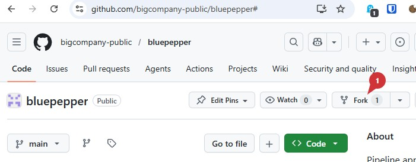

# Setting Up a Development Environment

## Forking and Cloning

- Fork [the repository](https://github.com/bigcompany-public/bluepepper) to your personal GitHub page (for example, `bluepepper_myProject`). This will make it easier to edit the configuration and deploy it to your team later.
    

- Clone the repository.

    ```
    git clone https://github.com/my-account/bluepepper_myproject.git
    ```

## Installation

- Run `install_dev.bat`.

    ??? question "Why are there two installation scripts?"
        You may have noticed bluepepper's directory contains a `install_dev.bat` file and a `install_enduser.bat`.
        
        The first initializes the repository in a way that prevents the update callback from triggering. This way, you can do your own thing without having BluePepper scrapping all your changes at launch.

- You can now open the app using the newly created BluePepper shortcut, but let's do some configuration first.


## Configuring the Project

Edit the file `conf/project.py`:memo: to match your project's needs:

=== "python"
    ```python
    class ProjectSettings:
        project_name: str = "MyIncredibleProject"
        project_code: str = "proj"
        width: int = 1920
        height: int = 1080
        fps: float = 25.0
        start_frame: int = 101
        production_trackers: list[str] = []
    ```

!!! info ""
    <a href="Next Section"> <div style="text-align: right; font-weight: bold"> [Next Section : Setting Up The Database](./dev_database.md) </div>