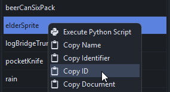
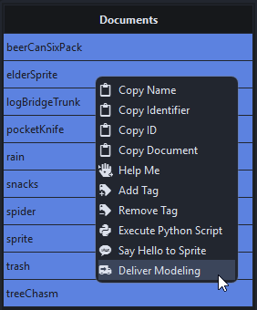
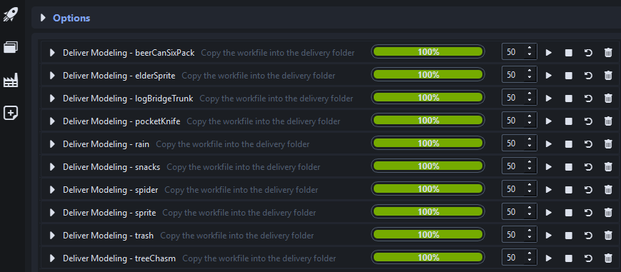
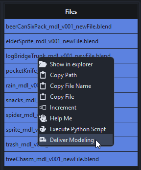

# Writing Your First Script

This section demonstrates how to use the `Database` and the `Codex`, and shows how to automate the resulting script with the Batcher.

In this example, we write a script that finds the latest version of an asset workfile and copies it to a delivery folder. The examples use documents and naming conventions from the demo project, feel free to adjust them to your needs.

!!! tip
    Before going any further, remember to initialize the terminal properly, as specified in [this section](dev_environment/#running-a-script)

    === "powershell"
        ```powershell
        & ./venvs/core_3.11.12/Scripts/python.exe ./main.py --shell
        ```

## Writing The Script Step By Step

### Laying the foundations

Create a new Python file `conf/scripts/my_first_script.py` :memo: with a placeholder `main()` function.

=== "Python"
    ```python
    """
    This script is designed to copy the last version of the modeling workfile to a delivery folder
    """

    import sys

    def main(document_id):
        print(f"Processing document ID: {document_id}")

    if __name__ == "__main__":
        main(sys.argv[1])
    ```

??? question "What is `sys.argv` ?"
    `sys.argv` returns the list of arguments provided to Python. Index 0 is the path to the script, and index 1 is the first argument passed to the script.

??? question "What is `if __name__ == "__main__"` ?"
    This line means "if this Python file is executed as a script". It prevents the `main()` function from running when the file is imported as a module.

You can now run your python script using this command:

=== "powershell"
    ```powershell
    & ./venvs/core_3.11.12/Scripts/python.exe ./conf/scripts/my_first_script.py "paste_document_id_here"

    >>> Processing document ID: 69ea2309a43cd5d382c0801b
    ```

??? question "How to get a document ID?"
    A document's ID can conveniently be copied directly from the Browser.

    


### Querying The Database

Having a document's ID is useful, but there is not much you can do with it on its own. The database provides a function to find the full document using its ID.

=== "Python"
    ```python
    from bluepepper.core import database

    def main(document_id):
        document = database.get_asset_document_by_id(document_id)
        print(f"Processing document: {document}")
    
    # >>> Processing document: {'_id': '69ea2309a43cd5d382c0801b', 'type': 'chr', 'asset': 'elderSprite', '_tags': ['categorie', 'sprite']}
    ```

### Finding Paths

BluePepper's Codex has functions to find files that match a specific naming convention. In our case, the `get_last_path()` function will fit our needs.

=== "Python"
    ```python
    from bluepepper.core import codex
    
    path = codex.convs.asset_modeling_workfile_blender.get_last_path(document)
    print(path)

    # >>> bluepepper_project\assetWorkspace\chr\elderSprite\mdl\blender\elderSprite_mdl_v001_newFile.blend
    ```

??? question "How did the file search work?"
    The Convention requires the fields `type`, `asset`, `version`, and `description`. The `asset` and `type` are taken from the document fields, resulting in a search string like this:

        bluepepper_project\assetWorkspace\chr\elderSprite\mdl\blender\elderSprite_mdl_v*_*.blend

    Lucent found all matching files and returned the last one.

### Constructing A Destination Path

Building paths by splitting and mixing parts of an existing path is not worth your time. Use the Codex instead.

Add a new Convention to the Codex in `conf/naming_conventions.py` :memo:

=== "Python"
    ```python
    class BluePepperConventions(Conventions):
        ...
        modeling_delivery = Convention("{@project_root}/delivery/{asset}_{task}_v{version}_{description}.{extension}")
    ```

Use this new Convention in the script. We'll use the `transmute()` function to convert a source path into a destination path.

=== "Python"
    ```python
    destination = codex.transmute(path, target_convention=codex.convs.modeling_delivery)
    print(destination)

    # >>> bluepepper_project/delivery/elderSprite_mdl_v001_newFile.blend
    ```

??? question "How did the transmutation work?"
    Lucent extracted the fields from the original path and deduced their values:

    - `asset` = `elderSprite`
    - `type` = `chr`
    - `task` = `mdl`
    - `dcc` = `blender`
    - `version` = `001`
    - `description` = `newFile`
    - `extension` = `blend`

    and used these values to fill the fields of another Convention.

    The `transmute()` function is a shorthand, but you can achieve the same result by parsing the original path and formatting a new one using another Convention.

    === "Python"
        ```python
        fields = codex.convs.asset_modeling_workfile_blender.parse(path)
        destination = codex.convs.modeling_delivery.format(fields)
        ```

### Copying The File

Now that we have the source and destination paths, the last step is to copy the file.

=== "Python"
    ```python
    from pathlib import Path
    import shutil

    Path(destination).parent.mkdir(parents=True, exist_ok=True)
    shutil.copy(path, destination)
    ```

### Full Code

Here is the full code of our awesome script:

=== "Python"
    ```python
    """
    This script is designed to copy the last version of the modeling workfile to a delivery folder
    """

    import shutil
    import sys
    from pathlib import Path
    from bluepepper.core import codex, database

    def main(document_id):
        document = database.get_asset_document_by_id(document_id)
        path = codex.convs.asset_modeling_workfile_blender.get_last_path(document)
        destination = codex.transmute(path, target_convention=codex.convs.modeling_delivery)
        Path(destination).parent.mkdir(parents=True, exist_ok=True)
        shutil.copy(path, destination)

    if __name__ == "__main__":
        main(sys.argv[1])
    ```

As you can see, using the `Database` together with the `Codex` allows file manipulations with very few lines of code.

## Process Assets In Batch

To turn this simple script into something we can process as a batch job, we will follow the steps described in the [Batcher Menu Action Tutorial](./dev_browser/#creating-a-batcher-job-through-a-menuaction).

Edit the Browser configuration file `conf/app_browser.py` :memo: to add a new action.

=== "Python"
    ```python
    from bluepepper.tools.browser.browser_config import BatcherMenuAction

    deliver_modeling_action = BatcherMenuAction(
        label="Deliver Modeling",
        job_name="Deliver Modeling - <document_name>",
        job_description="Copy the workfile into the delivery folder",
        batcher_module="conf.scripts.my_first_script",
        batcher_function="main",
        batcher_kwargs={"document_id": "<document_id>"},
        batcher_notification=True,
        batcher_notification_message="<document_name> - Delivery Done",
        qta_icon="mdi.truck-delivery",
    )

    asset_entity.add_document_action(deliver_modeling_action)
    ```

The contextual action is now available, and the Batcher will process the job.





## Process Files In Batch

For demonstration purposes, we performed document queries and file discovery to help you become acquainted with the `Database` and the `Codex`, but the Browser can already do most of the heavy lifting.

Our script can be adjusted to take a path as an argument instead of a document ID.

=== "Python"
    ```python
    import shutil
    import sys
    from pathlib import Path
    from bluepepper.core import codex

    def main(path):
        destination = codex.transmute(path, target_convention=codex.convs.modeling_delivery)
        Path(destination).parent.mkdir(parents=True, exist_ok=True)
        shutil.copy(path, destination)
    ```

And the BatcherMenuAction can be adjusted to be triggered with files instead of documents.

=== "Python"
    ```python
    deliver_modeling_action = BatcherMenuAction(
        label="Deliver Modeling",
        job_name="Deliver Modeling - <document_name>",
        job_description="Copy the workfile into the delivery folder",
        batcher_module="conf.scripts.my_first_script",
        batcher_function="main",
        batcher_kwargs={"path": "<path>"},
        batcher_notification=True,
        batcher_notification_message="<document_name> - Delivery Done",
        qta_icon="mdi.truck-delivery",
    )

    modeling_workfile_kind.add_file_action(deliver_modeling_action)
    ```

The Action can now be triggered on files, and the result will be the same.




---

!!! info ""
    <a href="Next Section"> <div style="text-align: right; font-weight: bold"> [Next Section : Deploying BluePepper](./dev_deployment.md) </div>