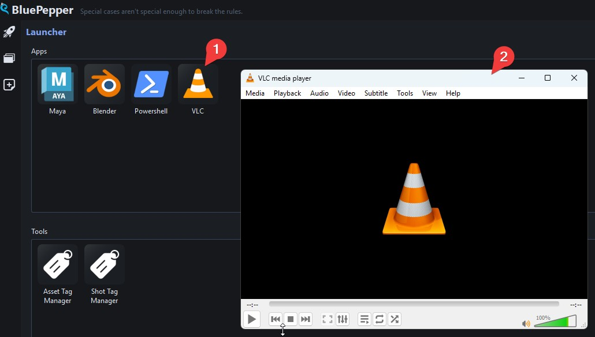
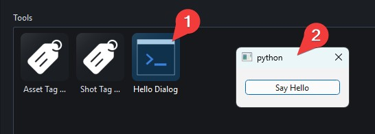
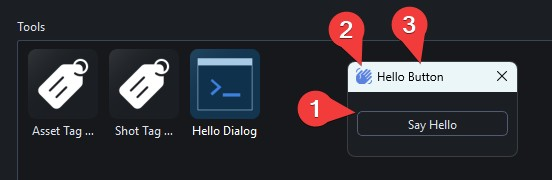

# Launcher Configuration

## Adding a New App
Let's add a simple icon to the Launcher that opens VLC.

First, create a file, for instance, `conf/scripts/vlc.py`:memo::

=== "python"
    ```python
    import subprocess

    def open_vlc():
        subprocess.Popen(["C:/Program Files/VideoLAN/VLC/vlc.exe"])
    ```

Then open `conf/app_launcher.py`:memo: and append an item to the `apps` list:

=== "python"
    ```python
    class DefaultLauncherConfig(LauncherConfig):
        apps: list[LauncherItem] = [
            LauncherItem(
                label="VLC",
                icon="software_vlc.png",  # all icons are stored in bluepepper/gui/icons
                module="conf.scripts.vlc",
                function="open_vlc",
                tooltip="Opens VLC",
            ),
        ]
    ```

A new app icon will appear in the Apps section of the Launcher, and VLC will open when you double-click it.



!!! tip
    Note that there is no technical difference between apps and tools, it is simply a convenient way to organise your icons. If you wanted the VLC icon to appear at the bottom of the Launcher, you would add the `LauncherItem` to `tools` instead of `apps`.


This approach to launching applications through custom functions gives you a great deal of flexibility from simple one-liners to complex launch sequences. See `maya_launcher.py`:memo: for a more involved example.

## Adding a Qt Tool

BluePepper uses PySide6 for its interface, so you can open your own Qt Dialogs from the Launcher. Let's create one in a new file `conf/scripts/open_dialog.py`:memo::

=== "python"
    ```python
    # BluePepper uses qtpy to wrap around PySide6 and PySide2
    from qtpy.QtWidgets import QDialog, QPushButton, QVBoxLayout

    class HelloDialog(QDialog):
        def __init__(self, parent=None):
            super().__init__(parent)
            layout = QVBoxLayout()
            self.setLayout(layout)
            self.button = QPushButton("Say Hello")
            layout.addWidget(self.button)
            self.button.clicked.connect(self.say_hello)

        def say_hello(self):
            print("hello")

    def show_dialog():
        dialog = HelloDialog()
        dialog.exec()
    ```

Then add it to the Launcher:

=== "python"
    ```python
    tools: list[LauncherItem] = [
        LauncherItem(
            label="Hello Dialog",
            icon="console.png",
            module="conf.scripts.open_dialog",
            function="show_dialog",
            tooltip="Demo Qt Dialog",
        )
    ]
    ```



## About Beautiful Qt Dialogs

The dialog above is rather plain. BluePepper provides custom Qt widgets and dialogs to apply the correct stylesheet and ensure a consistent look across the application.

Here is a polished version of `open_dialog.py`:memo::

=== "python"
    ```python
    from qtpy.QtWidgets import QPushButton, QVBoxLayout, QWidget

    from bluepepper.gui.utils import get_qta_icon
    from bluepepper.gui.widgets.container import (
        ContainerDialog,
        ContainerWidget,
        get_qt_app,
    )


    class HelloWidget(QWidget):  # QWidget instead of QDialog
        def __init__(self, parent=None):
            super().__init__(parent)
            layout = QVBoxLayout()
            self.setLayout(layout)
            self.button = QPushButton("Say Hello")
            layout.addWidget(self.button)
            self.button.clicked.connect(self.say_hello)

        def say_hello(self):
            print("hello")


    def show_dialog():
        app = get_qt_app()
        icon = get_qta_icon(name="mdi6.hand-wave", scale_factor=1.25)
        widget = HelloWidget()
        container = ContainerWidget(widget=widget, icon=icon, title="Hello Button")
        dialog = ContainerDialog(container)
        dialog.exec()
    ```

The result will be identical in functionality, but with considerably more style (the BluePepper stylesheet, an icon, and a proper window title).



!!! question "How to get the icon code?"
    You can visit [this section](./dev_tips_and_tricks/#qtawesome-icons) for more information on the subject.

---

!!! info ""
    <a href="Next Section"> <div style="text-align: right; font-weight: bold"> [Next Section : Configuring Naming Conventions](./dev_naming_conventions.md) </div>