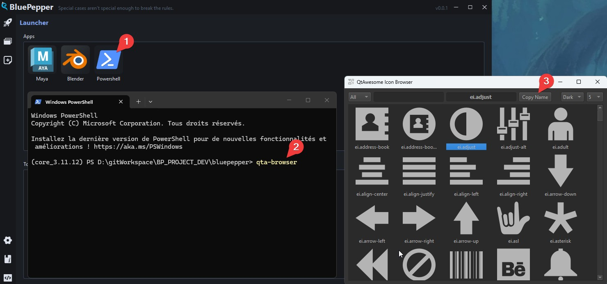

# Tips and Tricks

## QtAwesome Icons

BluePepper uses QtAwesome for its menu icons. To browse available icons, open a PowerShell terminal from the Launcher and run the command:

=== "powershell"
    ```powershell
    qta-browser
    ```



From there, you can copy the icon code.