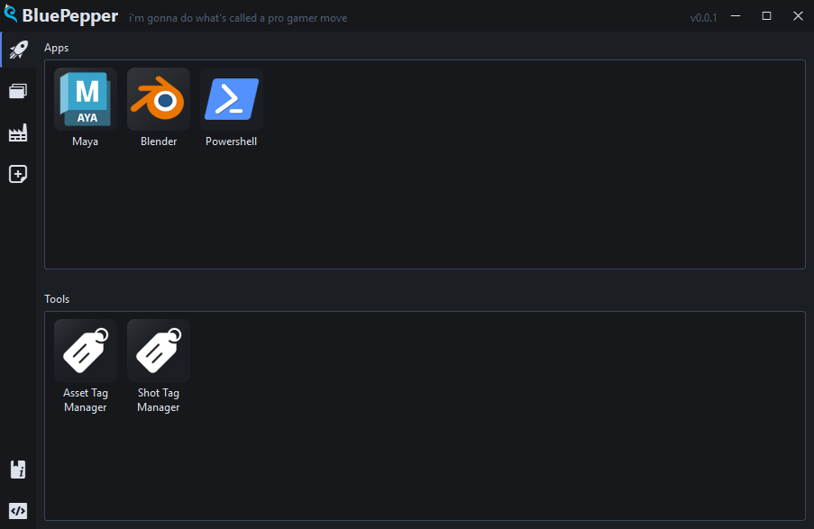
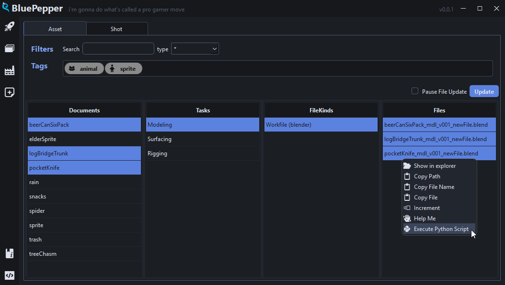
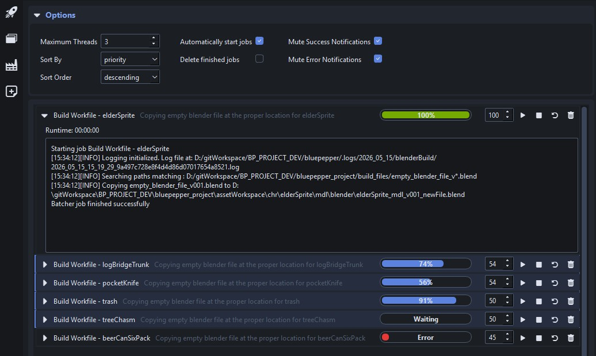

# BluePepper Documentation

## What is BluePepper?

BluePepper is a pipeline application designed for 2D/3D animation studios, whose main goal is to make navigation and automation efficient and simple to set up.

!!! note ""
    

    ---
    

    ---
    

## What Makes BluePepper So Spicy?

Here are the key design choices that make BluePepper different from other solutions:

- :heart: Extra care was taken to keep BluePepper lean and easy to use, providing the best experience for non-technical users.
- :balance_scale: It strikes a balance between ease of setup and automation capabilities. You will need basic development skills, but adding new features should be reasonably straightforward.
- :package: It operates independently from production trackers or elaborate online services.
- :money_with_wings: It is free and open-source.

## What BluePepper Is Not?

- BluePepper is **not a production tracker**. Assigning tasks and handling retakes is purposefully not part of BluePepper: you are free to use the production tracker that best fits your needs and can link it to BluePepper later if desired.

---

!!! info ""
    <a href="Next Section"> 
 [Next Section : Quick Start](./quick_start.md) 

