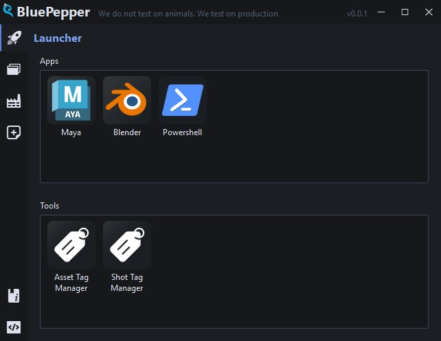

# BluePepper Documentation

## What is BluePepper?

BluePepper is a pipeline application designed for 2D/3D animation studios.

The project aims to achieve several key goals:

- Provide a straightforward and lean pipeline application that is easy to configure and use
- Operate independently from production trackers or elaborate online services
- Make navigation and automation efficient and simple to set up
- Strike the best balance between ease of setup and automation capabilities. You will need basic development skills, but adding new features should be reasonably straightforward

