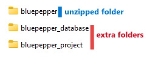
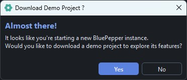
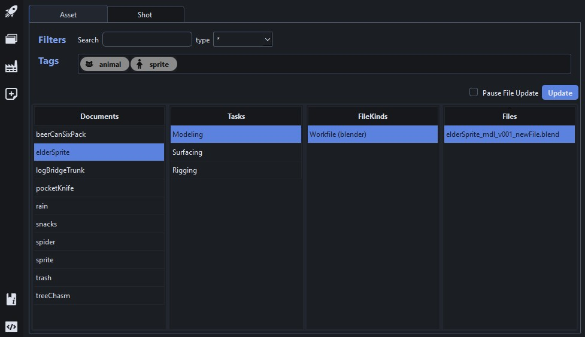
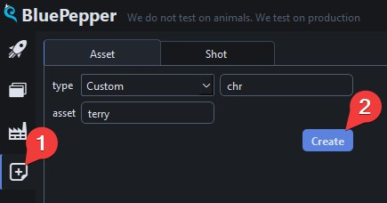
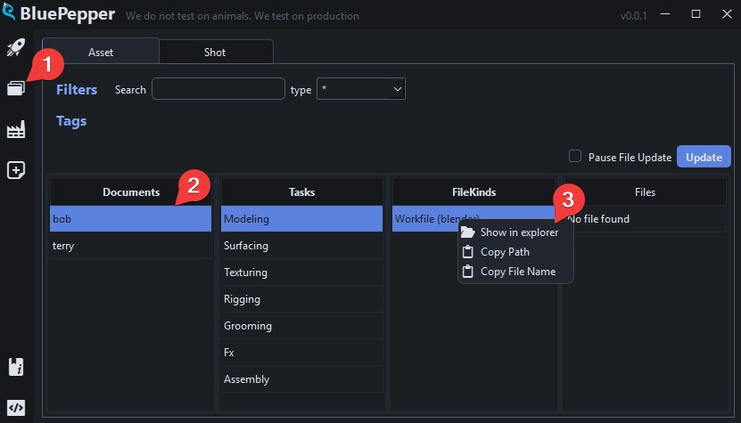
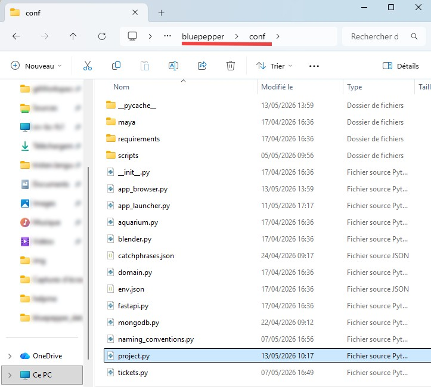

# Quick Start

## Installation

- :package: [Download the source code](https://github.com/bigcompany-public/bluepepper/archive/refs/heads/main.zip).
- Unzip it.
!!! tip
    When working on a local project, additional folders are created at first launch. You should unzip it into a new folder, for example `myProject`:open_file_folder:

    

- Run `install_dev.bat`:memo:.
- Double-click the newly created BluePepper shortcut.

!!! info
    If BluePeppers detects the project is empty, you will be prompted if you want to dowload a demo project.

    

    If you press "Yes", BluePepper will set up a database with a few assets/shots and will download a few blender files
    for you to play with.

    

## Lightning-Quick Overview

The various components of BluePepper can be accessed through the left sidebar.

- :one: The `Launcher`, which contains shortcuts to your software and tools.
- :two: The `Browser`, which allows you to browse files related to assets and shots.
- :three: The `Batcher`, where background jobs can be monitored.
- :four: The `EntityCreator`, which allows you to create new assets and shots.
- :five: There is also a link to the official `BluePepper documentation`
- :six: and a button to toggle the `System Console`.

From here, we advise you to create a few assets and shots using the EntityCreator, and play around in the Browser to see what you can do with it.

## Experimenting With Configuration Files

If you're feeling adventurous, you can explore the files in the `conf`:open_file_folder: folder and get a sneak peek at the inner workings of BluePepper.

!!! question
    Don't worry if you feel a bit lost with configuration files. Everything is explained in details in the [TD/Dev Documentation](./dev_core_concepts).

