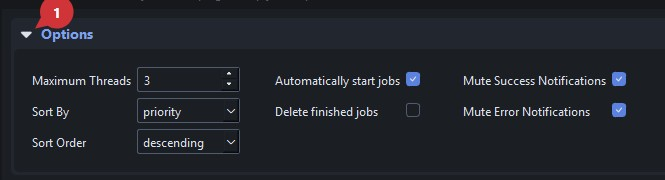
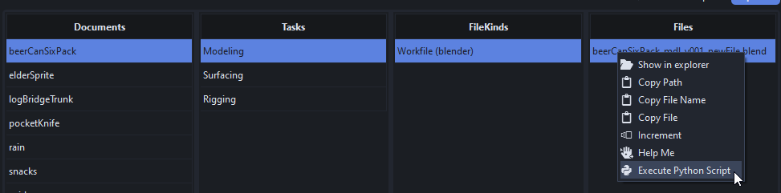
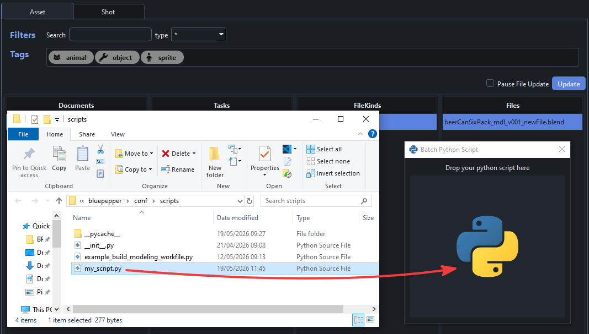
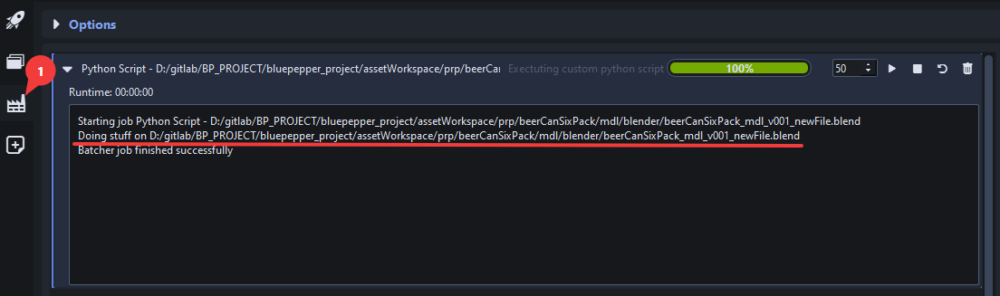
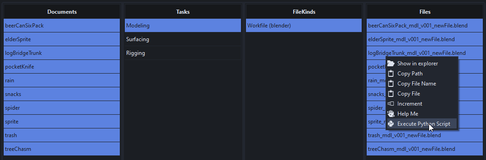
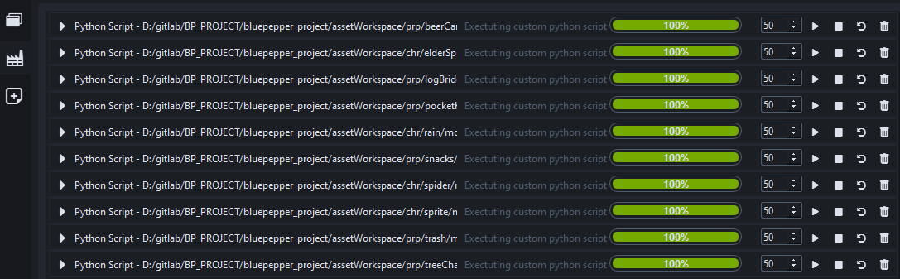
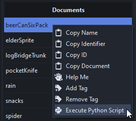
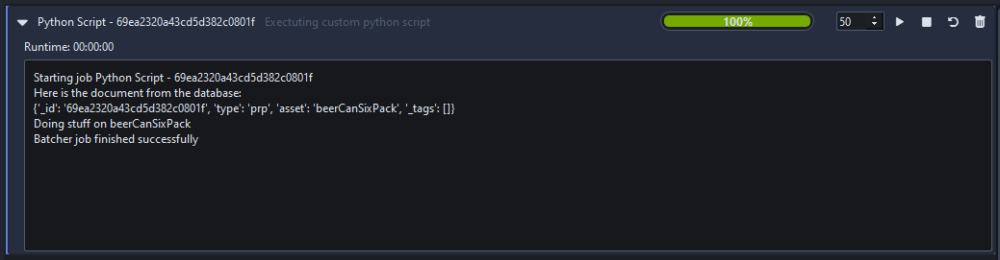

# Batcher

The Batcher is BluePepper's background job manager. Jobs are usually submitted to the Batcher using [Browser Actions](./user_browser/#actions)


## Managing Jobs

When submitted, all jobs shall have the `Waiting` status, then are executed in order of priority. If some jobs share the same priority, the manager will run jobs sorted by submission time (first-in, first-out)

Here are the actions you can perform on jobs:


- :one: Change job priority
- :two: Start job
- :three: Stop job
- :four: Retart job
- :five: Delete job

??? question "Sometimes, clicking "Start" does not start my job"
    The `Start Job` button actually sets the Job's status to `Waiting` in case it's current status was `Error` or `Terminated`, but the job manager will only execute it when the time comes : jobs that have a higher priority will be executed first.

??? question "What is the difference between Start and Restart?"
    In contrast with the `Start Job` button which ignores jobs that are already running, the `Restart Job` button will terminate running jobs before setting their status to `Waiting`

### Job Selection

Every button pressed (priority change, start, stop...) affects all selected jobs.

The Job List has an extended selection mode, so various shortcuts are available:

!!! tip ""
    - `Ctrl` + `click` -> additive selection 
    - `Shift` + `click` -> contiguous selection
    - `Ctrl` + `A` -> Select all
    - `Shift` + `left/right arrow` -> Extend selection up/down
    - `Ctrl` + `Space` -> Unselect last selected item

### Additional Shortcuts

!!! tip ""
    - `Suppr` -> Terminate and delete selected jobs  


## Options

The Options panel can be expanded/collapsed by clicking on the Options caret.



### Maximum Threads

Total number of jobs allowed to run simultaneously. Reducing it to zero will prevent any new job from starting.

### Sorting

Jobs can be sorted by:

- date
- name
- priority
- status

You may sort them in ascending or descending order

### Automatically Start Jobs

Tells the Job Manager if jobs should start as soon as possible. If unchecked, new jobs will not start, event if slots are available (see [Maximum Threads](./user_batcher/#maximum-threads))

### Delete Finished Jobs

If checked, the Jobs will be removed when done. By default, this option is unchecked, to give you the opportunity to read logs of finished Jobs.

### Mute Notifications

Being flooded with notifications when executing hundreds of jobs can be overwhelming: to mitigate this, the Batcher gives you control over `Success` and `Error` notifications. 

Feel free to adjust these settings to show exactly the notifications you actually need.

## Process Files In Batch

!!! tip "For advanced users only"

BluePepper provides an out of the box way of processing files in batch, by submitting a Job to the batcher for each selected file.

For demonstration purposes, let's create a new script `conf/scripts/my_script.py` :memo:

=== "python"
    ```python
    import sys

    def do_stuff(path):
        print(f"Doing stuff on {path}")

    if __name__ == "__main__":
        # The selected file that was passed as argument by the browser
        path = sys.argv[1]
        do_stuff(path)
    ```

Now, right click on the file(s) to process, run the action `Execute Python Script`, and drop your script on the dialog.




A job should appear in the Batcher. Here, you can see our `do_stuff` functions worked as intended and printed out the file's path.



You can now select as many files as you wish and batch any script you like.




!!! warning
    While doing an operation can be very useful, it can also be very dangerous as you may break a lot of files in the blink of an eye. Make sure to add a backup logic if you script involves removing or overwriting files

### About Documents

You can also send jobs to the Batcher from a document selection.



In this case, the document id is passed as argument to the script. You will then need to query the database in your script to recover the document. Here is an update on our example script that demonstrates this.

=== "python"
    ```python
    import sys
    from bluepepper.core import database

    def do_stuff(document_id):
        document = database.get_asset_document_by_id(document_id)
        print("Here is the document from the database:")
        print(document)
        print(f"Doing stuff on {document['asset']}")

    if __name__ == "__main__":
        document_id = sys.argv[1]
        do_stuff(document_id)
    ```

Exactly like for files, the script is executed for each selected document.



---

!!! info ""
    <a href="Next Section"> <div style="text-align: right; font-weight: bold"> [Next Section : EntityCreator](./user_entitycreator.md) </div>