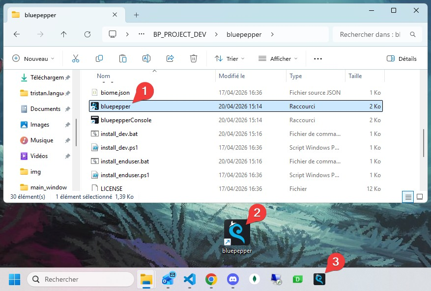
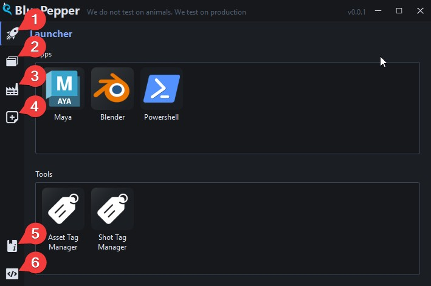

# BluePepper App Overview

After installation, a shortcut to the BluePepper App is available in the installation folder. You may copy it to your desktop or pin it to the taskbar if you wish.

The various components of BluePepper can be accessed through the left sidebar.

- :one: The `Launcher`, which contains shortcuts to your software and tools.
- :two: The `Browser`, which allows you to browse files related to assets and shots.
- :three: The `Batcher`, where background jobs can be monitored.
- :four: The `EntityCreator`, which allows you to create new assets and shots.
- :five: A link to the official `BluePepper documentation`.
- :six: A button to toggle the `System Console`.

---

!!! info ""
    <a href="Next Section"> 
 [Next Section : Launcher](./user_launcher.md) 
