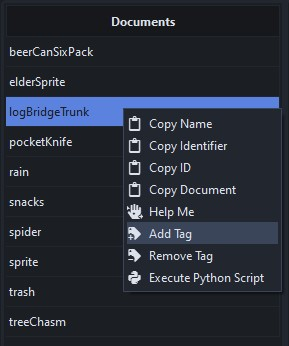
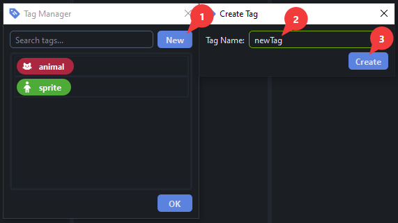
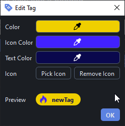
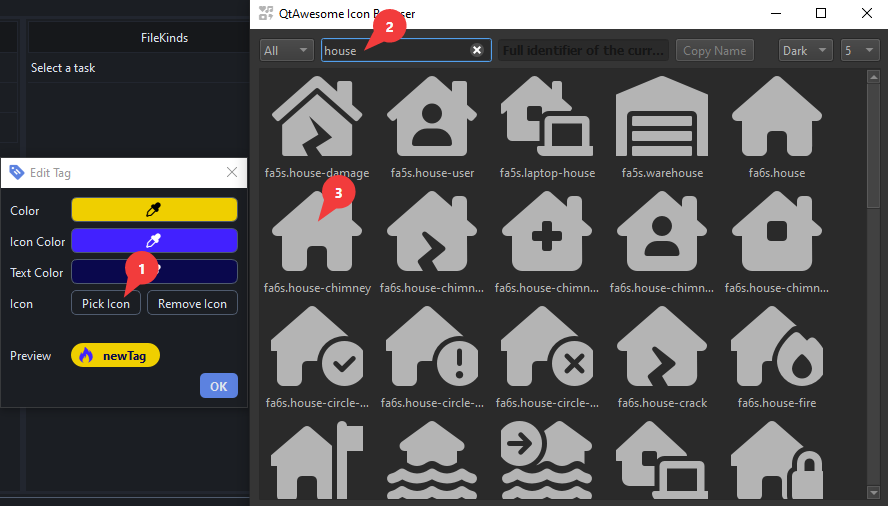
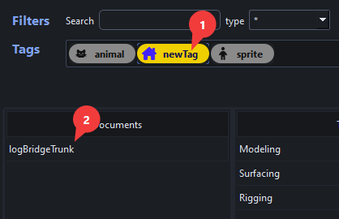
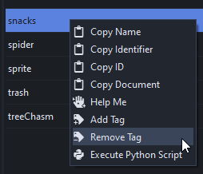
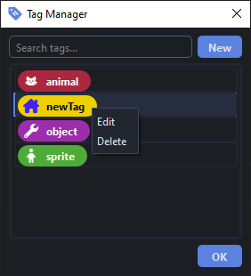
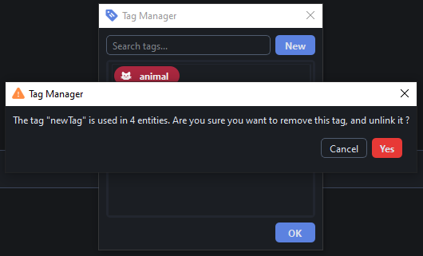
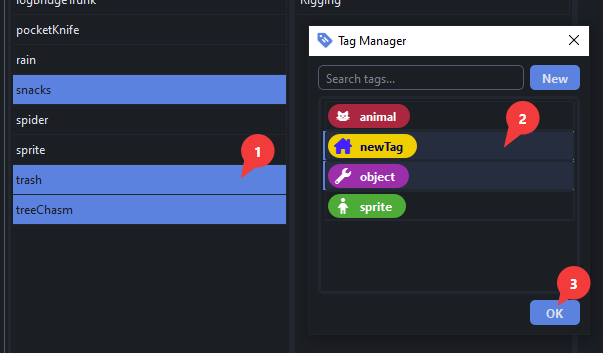

# Browser

The Browser allows you to browse files related to assets and shots. To look for files :

- Select the entity type :one:
- Select your asset/shot :two:
- File Kinds :four: are regrouped under tasks :three:
- Selecting an asset/shot document and a File Kind triggers a file search: all files matching the naming convention appear in the right hand side :five:.

    !!! warning
        This also mean that files that do not **strictly** match the naming convention will **not** appear.

        

## Selection

Searching for files with a single document selected will reveal **all** the files for this specific document.

On the other hand, looking for files with multiple documents selected will show the **last file** found for each.

!!! tip "Selecting Multiple Documents"

    The `Documents` and `Files` columns have an extended selection mode, so various shortcuts are available:

    - `Ctrl` + `click` -> additive selection 
    - `Shift` + `click` -> contiguous selection
    - `Ctrl` + `A` -> Select all
    - `Shift` + `up/down arrow` -> Extend selection up/down
    - `Ctrl` + `Space` -> Unselect last selected item

## Filters

The Browser comes with various filtering options to help you find your documents.

### Name Filter

The name filter looks for documents names that **contain** the search string, and is case insensitive.
For instance:

- `CAT` will return `catherine` and `blackCat`
- `er` will return `terry` and `pepper`

    

!!! tip
    Multiple search strings can be used at once, using the `;` separator:

    - `CAT;ry` will return `catherine`, `blackCat`, `terry` and `curry`

### Field Filter

Field filters are here to filter documents by other attributes than their name.
The filters are in order: from the less specific to the more specific, which helps you narrow down your query.

### Tag Filter

Tags is a more "freeform" way of sorting documents, as opposed to fields which are mandatory hard-written attributes of documents.

Click one or more tags to reveal documents that have any of the tags assigned to them.

!!! tip "Selecting Multiple Tags"
    The Tag filter has an extended selection mode, so various shortcuts are available:

    - `Ctrl` + `click` -> additive selection 
    - `Shift` + `click` -> contiguous selection
    - `Ctrl` + `A` -> Select all
    - `Shift` + `left/right arrow` -> Extend selection up/down
    - `Ctrl` + `Space` -> Unselect last selected item

## Actions

Various actions can be performed on the various elements of the Browser. BluePepper comes with a few handy actions out of the box, feel free to try them out.

 

When clicked, actions will run for all selected documents.

Please note that some actions (mainly the time consuming ones) will actually start a Batcher job. For more informations, see the [Batcher Documentation](./user_batcher)

## Tags

!!! question "Who should manage tags ?"
    In a project involving a team, it is advised that tags are handled by supervisors: while some tags are only used for filtering, others may be used to configure actions and tools.

### Creating and Adding Tags to Documents

Tags can be added to asset/shot documents, by right clicking on it and clicking `Add Tag`.

You may use existing tags or create a new one if needed.

The look of the tag is fully customizable

The `Pick Icon` button pops an Icon Browser window, where you can use the search bar, and double click on the icon you want to validate your choice.

When done, simply press `OK`, and you will be able to filter documents using the newly created tag.

### Removing a Tag From a Document

Tags can be removed from a document by right clicking on the document and clicking `Remove Tag`

### Editing and Deleting Tags

Tags can be edited or deleted by right clicking on them.

When deleting a tag, you will be prompted if the tag is applied to one or more documents.

### Multiple Documents, Multiple Tags

Both documents and tags are in extended selection mode: you may apply multiple tags to multiple documents in one go.

### Tag Managers

The tag manager we just mentioned can also be accessed from the Launcher.

## Tips And Tricks

!!! tip "Prefilled Naming Conventions"
    You need to create a file, but you are unsure about its naming convention?

    The built-in `Copy Path` and `Copy File Name` actions send prefilled names that respect the naming convention into you clipboard.

    For instance, if you do this:

    

    pressing `Ctrl + v` will paste this: `beerCanSixPack_mdl_v{version}_{description}.blend`

!!! tip "Reading a Document's Content"
    You can hover above documents to display the full document.

    

!!! tip "Advanced Document Search"
    If you feel like a power user, the search bar also handles mongoDB queries :muscle:

    - `{"asset": "sprite"}` will return documents where the `asset` key is **exactly** "sprite"
    - `{"asset" : {"$ne" : "spider"}}` will return all documents in which the `asset` key is **not** "spider".

--- 

!!! info ""
    <a href="Next Section"> 
 [Next Section : Batcher](./user_batcher.md) 
