# Browser

The Browser allows you to browse files related to assets and shots. To look for files :

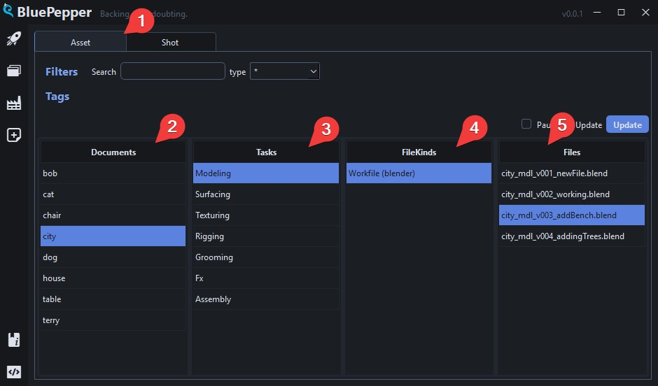

- Select the entity type :one:
- Select your asset/shot :two:
- File Kinds :four: are regrouped under tasks :three:
- Selecting an asset/shot document and a File Kind triggers a file search: all files matching the naming convention appear in the right hand side :five:.

    !!! warning
        This also mean that files that do not **strictly** match the naming convention will **not** appear.

    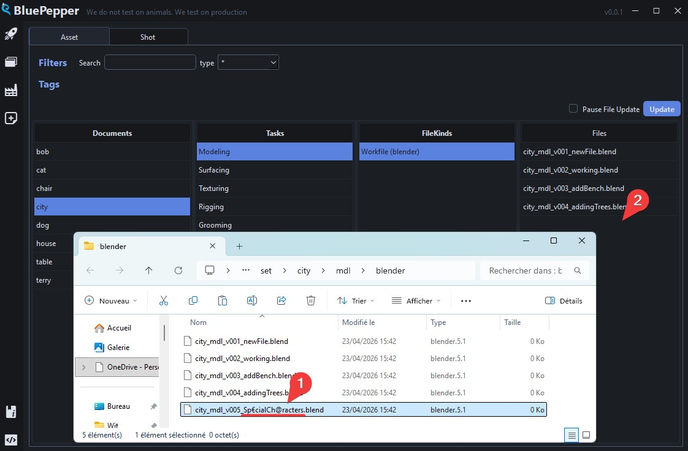

## Selection

Searching for files with a single document selected will reveal **all** the files for this specific document.

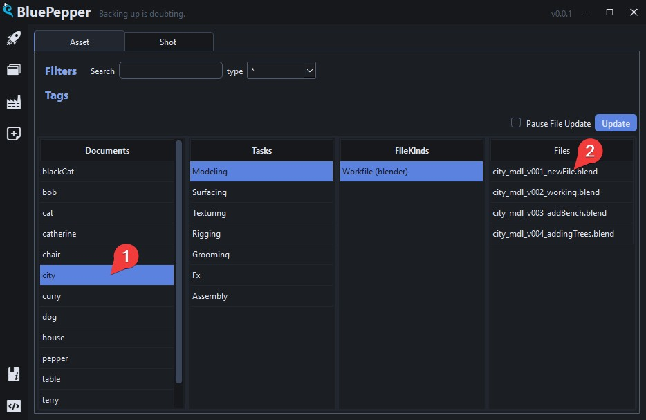

On the other hand, looking for files with multiple documents selected will show the **last file** found for each.

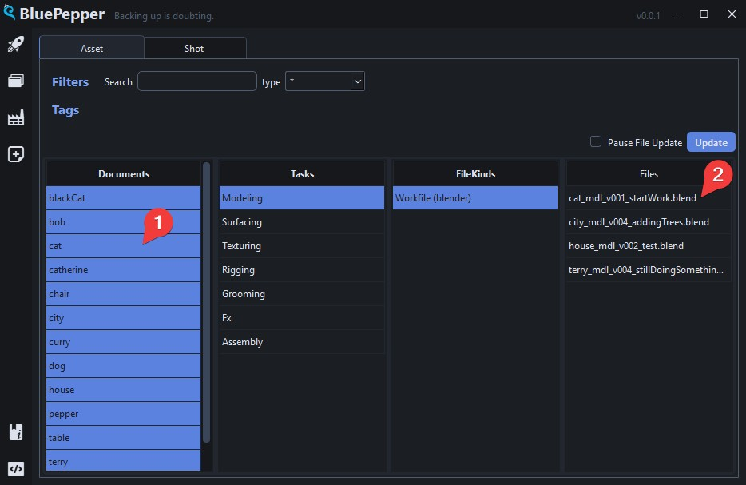

!!! tip

    The `Documents` and `Files` columns have an extended selection mode, so various shortcuts are available:

    - `Ctrl` + `click` -> additive selection 
    - `Shift` + `click` -> contiguous selection
    - `Ctrl` + `A` -> Select all
    - `Shift` + `up/down arrow` -> Extend selection up/down
    - `Ctrl` + `Space` -> Unselect last selected item

## Filters

The Browser comes with various filtering options to help you find your documents.

### Name Filter

The name filter looks for documents names that **contain** the search string, and is case insensitive.
For instance:

- `CAT` will return `catherine` and `blackCat`
- `er` will return `terry` and `pepper`

    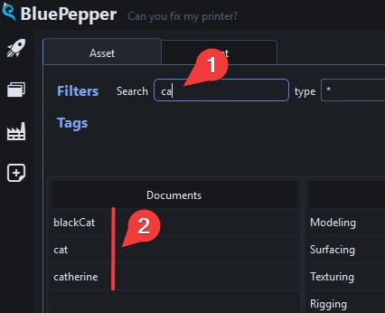

!!! tip
    Multiple search strings can be used at once, using the `;` separator:

    - `CAT;ry` will return `catherine`, `blackCat`, `terry` and `curry`

### Field Filter

Field filters are here to filter documents by other attributes than their name.
The filters are in order: from the less specific to the more specific, which helps you narrow down your query.

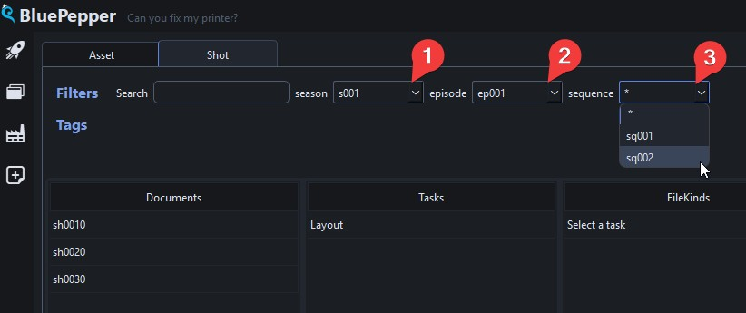

### Tag Filter

Tags is a more freeform way of sorting documents, as opposed to fields which are fixed.

Click one or more tags to reveal documents that have any of the tags assigned to them.

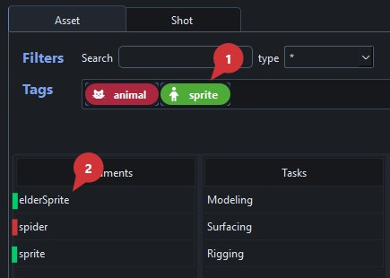

!!! tip
    The Tag filter has an extended selection mode, so various shortcuts are available:

    - `Ctrl` + `click` -> additive selection 
    - `Shift` + `click` -> contiguous selection
    - `Ctrl` + `A` -> Select all
    - `Shift` + `left/right arrow` -> Extend selection up/down
    - `Ctrl` + `Space` -> Unselect last selected item

## Actions

Various actions can be performed on the various elements of the Browser. BluePepper comes with a few handy actions out of the box, feel free to try them out.

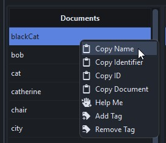 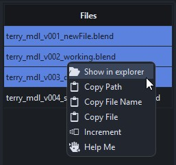

## Tips And Tricks

### Prefilled Naming Conventions

!!! tip
    You need to create a file, but you are unsure about its naming convention?

    The built-in `Copy Path` and `Copy File Name` actions send prefilled names that respect the naming convention into you clipboard.

    For instance, if you do this:

    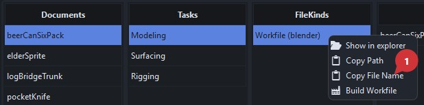

    pressing `Ctrl + v` will paste this: `beerCanSixPack_mdl_v{version}_{description}.blend`

### Reading a Document's Content

!!! tip
    You can hover above documents to display the full document.

    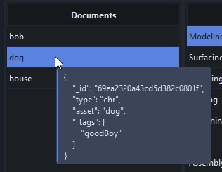

### Advanced Document Search

!!! tip
    If you feel like a power user, the search bar also handles mongoDB queries :muscle:

    - `{"asset": "sprite"}` will return documents where the `asset` key is **exactly** "sprite"
    - `{"asset" : {"$ne" : "spider"}}` will return all documents in which the `asset` key is **not** "spider".