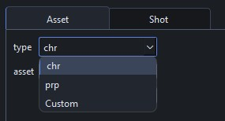
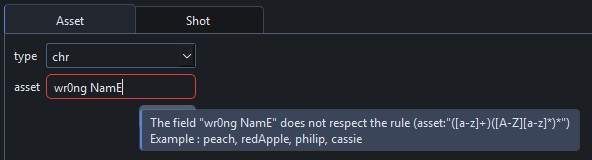

# Entity Creator

The EntityCreator lets you create new asset or shot documents for your project.

??? question "Who should create entities?"
    In a team environment, it's recommended that supervisors use this tool. In general, database operations should be limited to a small number of trusted users.

For each field, the combo box displays values found in other documents. If the value you want is not in the list, select `Custom` and enter a new value.

When providing values, the EntityCreator ensures each provided field respects the naming convention.

!!! tip
    If a value is incorrect, hover over the text to see a tooltip with the exact naming convention.

    

---

!!! info ""
    <a href="Next Section"> 
 [Next Section : TD/Dev Documentation](./dev_core_concepts.md) 
