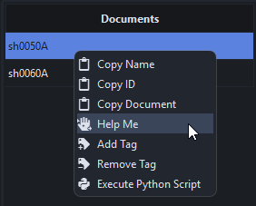
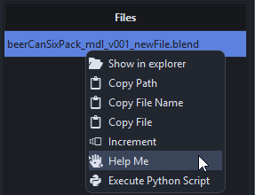
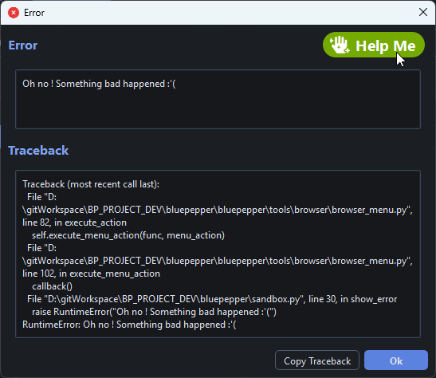
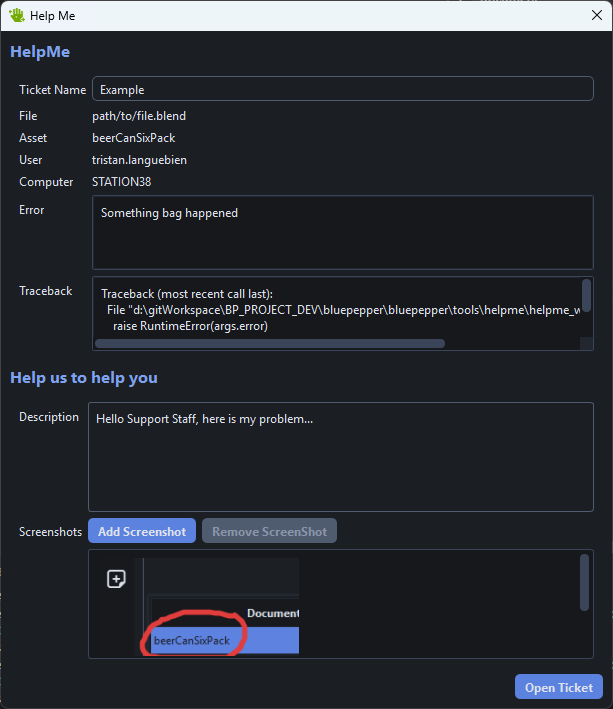

# Getting Help

# HelpMe Tool

BluePepper has a dedicated tool to facilitate opening tickets called `HelpMe`.

`HelpMe` can be opened in several ways:

1. From the browser:
    - Right click on a document -> Help Me

        

    - Right click on a file -> Help Me

        

2. From an error popup:

    

3. Wherever the `HelpMe` button appears
    - `HelpMe` can be inserted into other tools. If you see it, you can ask for help.

## Opening A Ticket

When you open `HelpMe`, the tool pre-fills the ticket with useful information based on the context (the selected document/file, the error encountered, etc.).

You can then add a description of your issue and attach screenshots.

When you click `Open Ticket`, BluePepper copies the ticket to your clipboard so you can paste it wherever you like (email, Discord, ticketing provider, etc.).

!!! tip
    This method of handling tickets is a placeholder, but your dev/IT department may connect it to their preferred ticketing solution.

